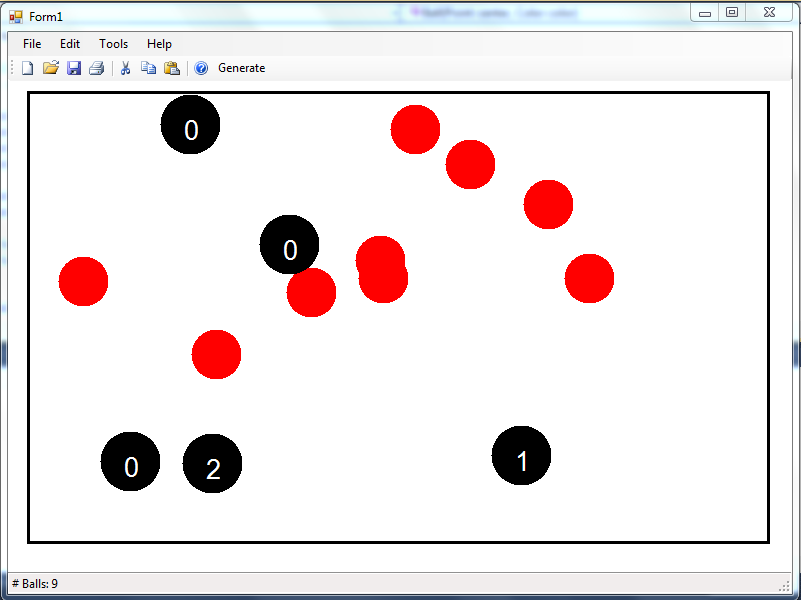

Да се имплементира апликација во која ќе се исцртуваат топчиња кои се движат.

Топчињата (радиус 25 пиксели) се додаваат и започнуваат да се движат (во случајна насока) со лев клик во рамките на обележаните граници на прозорецот. На секои 50 милисекунди секое од топчињата се придвижува за 10 пиксели. **10 поени**

Актуелната боја на топчињата кои се креираат со кликнување може да се постави од главното мени Edit->Color. **5 поени**

Во рамките на обележаните граници на прозорецот се исцртуваат и точно 5 црни дупки (кругови) со радиус 30 на случајни позиции и не смее да се преклопуваат. Со клик на копчето `Generate` се генерираат и исцртуваат нови 5 црни дупки. **15 поени**

Кога некое од топчињата ќе се доближи на растојание 25 (радиусот на топчето) до центарот на некоја од дупките тоа пропаѓа (се брише), а бројачот на таа дупка се зголемува за 1. **10 поени**

На статусната линија се прикажува моменталниот број на тековни топчиња. **5 поени**

Да се имплементира серијализација (зачувување и вчитување) во датотека на состојбата на оваа апликација. **5 поени**

