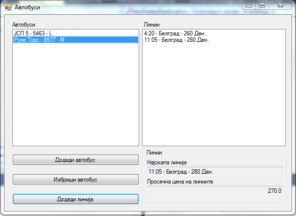
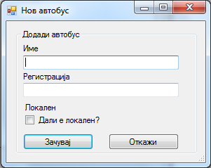
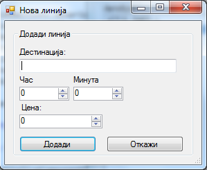

Да се имплементира `Windows Forms` апликација во која се чува листа на автобуси. За секој автобус се чува:

- регистрација (string)
- име (string)
- дали е локален (bool)
- листа со линии (за секоја линија се чува дестинација, час тргнување, минута тргнување и цена).

Треба да се имплементираат следните функционалности:

- додавање нов автобус (клик на копчето **Додади автобус**) во листата со автобуси `ListBox` **(20 поени)**
 - се отвара нова форма во која се внесуваат валидни информации (името не смее да биде празно, а регистрацијата треба да биде точно 4 цифри) за автобусот **(10 поени) валидација**
- бришење автобус (клик на копчето **Избриши автобус**) од листата со автобус, со прозорец за предупредување (YES/NO) **(10 поени)**
- додавање нова линија за некој избран автобус во листата со линии (клик на копчето **Додади линија**) **(20 поени)**
 - се отвара нова форма во која се внесуваат валидни информации (дестинацијата не смее да биде празна) за линијата **(5 поени)**

Со промена на селекцијата на елемент од листата со автобуси, се пополнува листата со линии со линиите на избраниот автобус **(20 поени)** и дополнително:

- се пресметува и прикажува просечната цена за сите линии на избраниот автобус **(5 поени)**
- се наоѓа и прикажува линијата со најголема цена **(10 поени)**

**За сите останати функционалности тестирајте ја извршната верзија на апликацијата која може да ја симнете подолу.**

