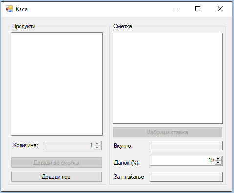
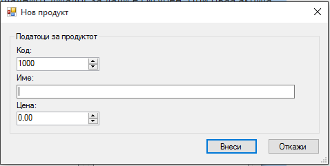

Да се имплементира апликација за едноставна каса во продавница. Во касата се чува листа на продукти (код, име и цена) и листа на ставки (продукт и количина). **(5 поени)**

Продукти се додаваат со нова форма која се појавува на копчето „**Додади нов**“. Притоа во оваа форма не се дозволува внесување продукт без име, односно се врши валидација на името со помош на `ErrorProvider`. **(10 поени)** Исто така, ако во листата со продукти веќе постои продукт со ист код како кодот на продуктот што се внесува, се прикажува соодветна порака за дупликат код и продуктот не се внесува. **(10 поени)**

Со клик на копчето **Додади во сметка** кое е овозможено само ако има избрано продукт од листата со продукти, се внесува нова ставка во сметката. При секое додавање на нова ставка, се ажурираат вредностите за вкупно вредност на сметката, како и вкупна цена со пресметан данок. Овие вредности исто така се ажурираат на секоја промена на полето за данок (кое може да има вредности од 1 – 25). **(15 поени)**

Приказот на продуктите во листата е во следниот формат: `Код : Име Цена (две децимали)`.

Приказот на ставките во листата е во следниот формат: `Име на продукт Цена на продукт X количина = Вкупна цена (две децимали)`.
 
Со клик на копчето **„Избриши ставка“** се брише избраната ставка, ако корисникот одговори потврдно на прашалниот дијалог за дали е сигурен. При оваа акција исто така се ажурираат вредностите за вкупно вредност на сметката, како и вкупна цена со пресметан данок. **(10 поени)**

**За сите останати функционалности тестирајте ја извршната верзија на апликацијата која може да ја симнете подолу.**

