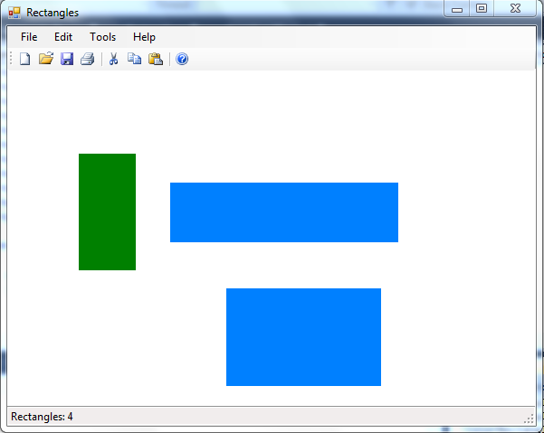

Да се имплементира апликација цртко за исцртување правоаголници. За да се исцрта правоаголник, најпрво со лев клик на глувчето се означува едно теме на правоаголникот, а со следниот клик се означува дијагоналното теме на првично зададеното. По означување на првото теме на правоаголникот и придвижување на глувчето, се исцтува правоаголникот со точкаста линија. **(15 поени)**

Бојата на правоаголникот кој се исцртува се избира од дијалог за избор на боја кој се активира преку менито `Edit->Color`. Почетната боја е сина. **(10 поени)**

Со десен клик во површината на правоаголникот тој се означува како избран (се исцртува црвен правоаголник околку него). Ако претходно бил избран, се поставува во почетната состојба. Ако два правоаголници се поклопуваат, се означува прво додадениот. **(10 поени)**

Со притискање на копчето `Delete` од тастатура се бришат сите избрани правоаголници. **(5 поени)**

На статусната линија се прикажува моменталниот број на правоаголници кои се исцртани. **(5 поени)**
Да се имплементира серијализација (зачувување и вчитување) во датотека на состојбата на оваа апликација. **(5 поени)**

**За сите останати функционалности тестирајте ја извршната верзија на апликацијата која може да ја симнете подолу.**

Изглед на апликацијата:

