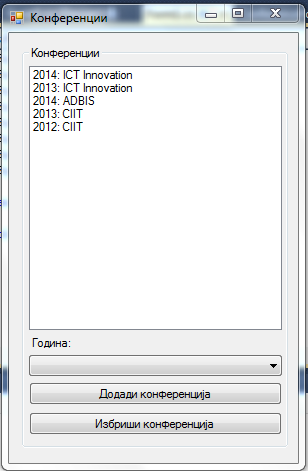
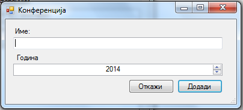

Да се имплементира `Windows Forms` апликација во која се чува листа на конференции. За секоја конференција се чува:

- id (string) (се генерира во конструкторот со помош на методот `Guid.NewGuid().ToString();`
- име (string)
- година (int).

Треба да се имплементираат следните функционалности:

- додавање нова конференција (клик на копчето **Додади конференција**) во листата со конференции `ListBox` **(10 поени)**
 - се отвара нова форма во која се внесуваат валидни информации (името не смее да биде празно) за конференцијата. Валидацијата да се имплементира со `ErrorProvider`. **(10 поени) валидација**
- бришење конференција (клик на копчето **Избриши конференција**) од листата со конференции, со прозорец за предупредување (YES/NO) **(10 поени)**.

Со помош на контролата `ComboBox` (стил `DropDownList`) и промена на селектираната ставка да се прикажуваат во листата само конференциите кои се од избраната година. Се пополнува со -1 и со годините во кои има конференции во горната листа и тоа секоја година по еднаш само. Ако се избере година -1 се прикажуваат сите конференции. **(20 поени)**

**За сите останати функционалности тестирајте ја извршната верзија на апликацијата која може да ја симнете подолу.**

