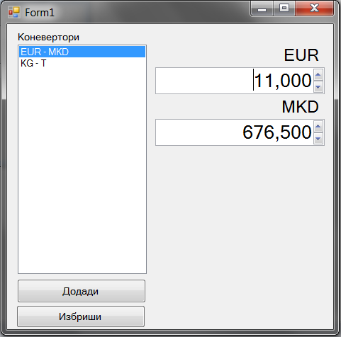
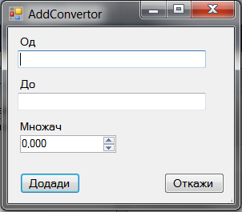

Да се имплементира `Windows Forms` апликација која служи како конвертор. Секој конвертор е дефиниран со:

- конверзија од (string)
- конверзија во (string)
- множач (decimal) (вредноста која се конвертира се множи со овој број да се добие конвертирана вредност). Пр од ЕУР вредноста 1 се множи со 61.5 (множач) да се добие 61.5.

Треба да се имплементираат следните функционалности:

- додавање нова конверзија (клик на копчето **Додади**) во листата со конверзии `ListBox` **(10 поени)**
 - се отвара нова форма во која се внесуваат валидни информации (од и до не смеат да бидат празни и множачот е поголем од 0). Валидацијата да се имплементира со `ErrorProvider`. **(10 поени) валидација**
- бришење конверзија (клик на копчето **Избриши**) од листата со конверзии, со прозорец за предупредување (YES/NO) **(5 поени)**
- при промена на избраната конверзија од листата, се поставуваат соодветни лабели (коверерзија од, конверзија во) и се врши конверзија вредностите во двете полиња за внес на броеви. Исто така при промена на вредноста на двете полиња се врши конверзија. **(15 поени)**

**За сите останати функционалности тестирајте ја извршната верзија на апликацијата која може да ја симнете подолу.**

