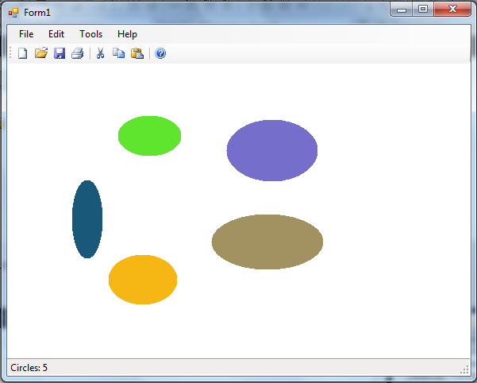

Да се имплементира апликација која ќе исцртува елипси. За да се исцрта елипса, најпрво со лев клик на глувчето се означува левото коше на елипсата, а со следниот клик се означуваат нејзината ширина и висина. Откако ќе се означи левиот горен агол на правоаголникот кој ја опишува елипсата, при придвижување на глувчето со испрекината линија се исцтува елипсата. Ако се придвижиме лево или горе од првата зададена точка на елипсата, соодветната компонента (x, y) станува лев горен агол на правоаголникот кој ја опишува.

Бојата на секоја нова елипса кој се додава е составена од нови 3 случајни броеви за црвената, зелената и сината компонента (R, G, B).

Со помош на тајмер со интервал на 200 милисекунди, се менува бојата на елипсите со додавање на 5, 10 и 15 на црвената, зелената и сината компонента соодветно. Притоа се внимава ако се надмине 255, која е максималната вредност на компонентата, се врши модул операција со 256.

На статусната линија се прикажува моменталниот број на елипсе кои се исцртани.

Да се имплементира серијализација (зачувување и вчитување) во датотека на состојбата на оваа апликација.
 

Достапна ви е извршна верзија на апликацијата преку која може детално да ги тестирате сите функционалности кои треба да се имплементираат.
