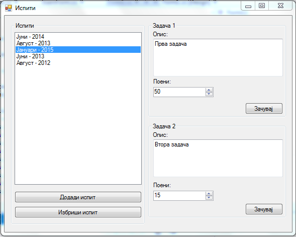
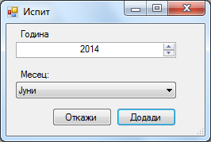

Да се имплементира `Windows Forms` апликација во која се чува листа на испити. За секој испит се чува:

- месец (string)
- година (int).

На почетокот да се пополни листата со барем 2 испити. **(15 поени)**

Треба да се имплементираат следните функционалности:

- додавање нов испит (клик на копчето **Додади нов испит**) во листата со испити **(5 поени)**
 - се отвара нова форма во која се внесуваат валидни информации (мора да се избере месец) за испитот (се имплментира со `ErrorProvider`) **(5 поени)**

- бришење на испит од листата (клик на копчето **Избриши испит**) **(5 поени)**
 - се додека не се избере испит од листата копчето за бришење да биде оневозможено **(5 поени)**

При избор на испит од листата, во десниот дел се прикажуваат информации (опис и поени) за две задачи од тој испит. Овие информации може да се менуваа и зачуваат со клик на копчето **Зачувај**. **(15 поени)**

**За сите останати функционалности тестирајте ја извршната верзија на апликацијата која може да ја симнете подолу.**

