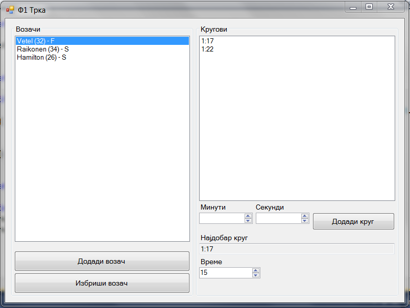
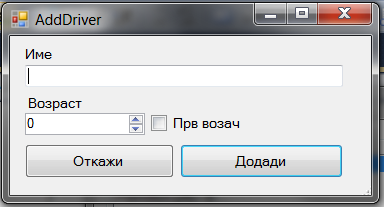

Да се имплементира `Windows Forms` апликација во која се чува листа на Ф1 возачи. За секој возач се чува:

- име (string)
- возраст (int)
- дали е прв возач (bool)
- листа со кругови (за секој круг се чува времето (минути и секунди)).

Треба да се имплементираат следните функционалности:

- додавање нов возач (клик на копчето **Додади возач**) во листата со возачи `ListBox` **(20 поени)**
 - се отвара нова форма во која се внесуваат валидни информации (името не смее да биде празно) за возачот. Валидацијата да се имплементира со `ErrorProvider`. **(10 поени) валидација**
- бришење возач (клик на копчето **Избриши возач**) од листата со возачи, со прозорец за предупредување (YES/NO) **(10 поени)**
- додавање нов круг за избраниот возач (клик на копчето **Додади круг**) со времињата внесени во соодветните контроли **(15 поени)**
  - полето за секунди се менува од 0 до 59 при што ако се зголеми над 59 се додадва 1 минута и секундите се враќаат на 0. **(10 поени)**

**(бонус 5)** Ако вредноста за секунди е 0 и ако минутите се поголеми од 0, и се притисне надолу, минутите да се намалат за 1 а секундите да се постават на 59. Пр. од 2:00 -> 1:59

Со промена на селекцијата на елемент од листата со возачи, се пополнува листата со кругови на избраниот возач **(15 поени)** и дополнително:

- се наоѓа и прикажува најдобриот круг (кругот со најмало време) **(10 поени)**
- во листата со кругови секогаш се прикажуваат само кругови со поголемо време (во секунди) од времето внесено во контролата означена со `Време` **(10 поени)**

**За сите останати функционалности тестирајте ја извршната верзија на апликацијата која може да ја симнете подолу.**

