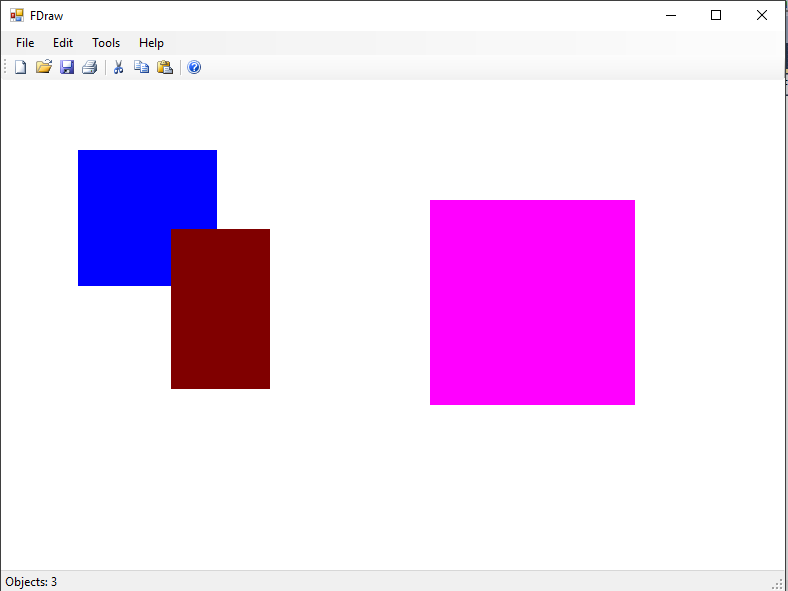

Да се имплементира апликација во која ќе се исцртуваат правоаголници и квадрати (во понатамошниот текст фигури) во различни бои (почетна сина). 

Исцртувањето започнува со лев клик со глувчето, при што копчето се држи притиснато, а во моментот кога ќе се отпушти се исцртува фигурата. **(10 поени)**

Додека го движиме глувчето при исцртување фигура, се исцртува контура (со точки) на фигурата. **(5 поени)**

Ако при исцртувањето на контурата на фигурата, се држи притиснато копчето `Ctrl` со код `Keys.ControlKey`, фигурата која се исцртува секогаш е квадрат со страна еднаква на поголемото од растојанието по X и растојанието по Y оската. **(10 поени)**

Ако лев клик на глувчето се случи врз фигура, се додека е притиснато копчето и го движиме глувчето се поместува фигурата соодветно. **(10 поени)**

При поместување или исцртување на фигури кои се преклопуваат, се поместува/исцртува фигурата која е прво додадена во листата со фигури.

Со клик на менито `Edit->Color` се отвара форма за менување на бојата со која се исцртуваат фигурите. **(5 поени)**

На статусната линија се прикажува вкупниот број на исцртани фигури. **(5 поени)**

Да се имплементира серијализација (зачувување и вчитување) во датотека на состојбата на оваа апликација. **(5 поени)**

**Достапна ви е извршна верзија на апликацијата преку која може детално да ги тестирате сите функционалности кои треба да се имплементираат.**

