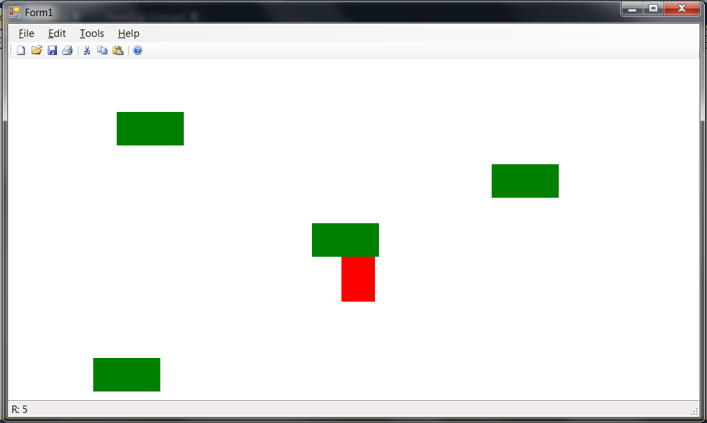

Да се имплементира апликација во која ќе се цртаат правоаголници со широчина 100 и висина 50 точки. Правоаголниците се додаваат со двоен клик кој го дефинира центарот на новиот правоаголник. **(10 поени)**

Со лев клик врз одреден правоголник истиот започнува да се движи надолу при што се придвижува за неговата висина на секои 0.5 секунди. Ако се кликне со десен клик врз правоголникот тој почнува да се движи надесно ротирајќи за 90° на секои 0.5 секунди. Клик врз правоаголник кој веќе се движи се игнорира. **(20 поени)**

По излегување од работниот прозорец правоаголникот се брише (се намалува бројот на правоаголници прикажани на статусната линија). **(5 поени)**

Преку мени Edit->Color се отвора дијалог со кој се менува бојата на правоаголниците кои се додаваат (на почеток е црвена). **(5 поени)**

На статусната линија се прикажува моменталниот број на правоаголници во работниот прозорец. **(5 поени)**

Да се имплементира серијализација (зачувување и вчитување) во датотека на состојбата на оваа апликација. **(5 поени)**

**Достапна ви е извршна верзија на апликацијата преку која може детално да ги тестирате сите функционалности кои треба да се имплементираат.**

