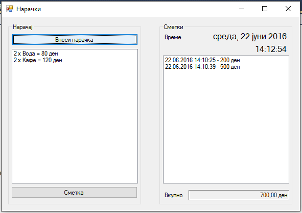
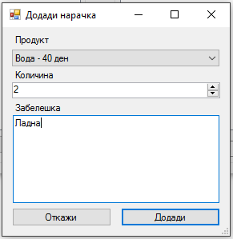

Да се имплементира `Windows forms` апликација за вршење нарачки. Треба да се имплементираат следните функционалности:

- **Внеси нарачка** - со клик на ова копче се отвара нова форма за додавање нарачка. Во формата од `ComboBox` се одбира еден од понудените продукти (име и цена), се внесува количина (1-100) и се внесува опиционално забелешка. Листата со продукти да биде пополнета барем со 3 различни продукти. Со клик на копчето **Додади** кое е овозможено само ако е избран продукт, се внесува нарачката во листата со нарачки, при што се прикажува `количината x името на продуктот = вкупна цена`. Клик на копчето **Откажи** ја откажува нарачката. **(15 поени)** 

- Да биде овозможено додавање на нарачка со копчето `ENTER` и откажување со `ESC`. **(5 поени)**

- Во десниот горен агол во текстуална лабела се прикажува моменталниот датум и време со помош на `Timer` со интервал на ажурирање 500 милисекунди. Форматот на датумот е `ToLongDateString`, а на времето `ToLongTimeString`. **(10 поени)**

- Со клик на копчето  **Сметка** се врши издавање на сметка, така што се пресметува вкупната сума на сите нарачки, се бришат нарачките од листата со нарачки и се додава запис (време на издавање на сметката и сума) во листата со сметки. **(10 поени)**

- Под листата со сметки во текстуалното поле овозможено само за читање се прикажува вкупната сума на сите издадени сметки. **(10 поени)**

За останатите детали за начинот на функционирање, симнете и стартувајте ја извршната верзија на апликацијата дадена подолу.

