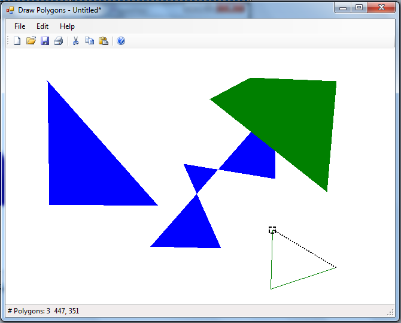

Да се имплементира апликација во која се исцртуваат полигони. Со првиот лев клик со глувчето се поставува првата точка од полигонот. Откако е поставена барем една точка од полигонот со придвижување на покажувачот се исцтува испрекината линија од последно поставената точка до тековната позиција на глувчето. Ако покажувачот се придвижи на одалеченост помала од 5 точки (лево, горе, десно или долу) од локацијата на првата поставена точка, околу оваа точка со испрекината линија се исцртува квадратче со страна 10 точки. Ако со глувчето се кликне во внатрешноста на вака исцраното квадратче и ако полигонот е составен од барем 3 темиња тогаш се исцртува овој полигон исполнет со тековната боја за цртање. 

Од основното мени на апликацијата во подменито “Edit->Color” преку дијалог за избор на боја се поставува бојата на следниот полигон.

Со избор на „New” од мени-то или соодветната иконка од алатникот се бришат сите полигони од тековниот документ.

Со притискање на тастерите горе, долу, лево и десно (Keys.Up, Keys.Down, Keys.Left, Keys.Right) се придвижуваат сите полигони во соодветната насока за 5 точки.

Да се имплементира серијализација (зачувување и вчитување) на документ од оваа апликација. Истата се повикува преку стандардните опции од мени-то и алатникот (“Save”, “Open”).

На статусната лента од оваа апликација се прикажува вкупниот број на полигони и тековната позицијата на покажувачот.

Бонус (5 поени): Да се имплементира прашален дијалог за снимање на документот кога има промени во истиот и да се прикаже името на тековниот документ во насловот на прозорецот.

Достапна ви е извршна верзија на програмата преку која може детално да ги тестирате сите функционалности кои треба да се имплементираат.
