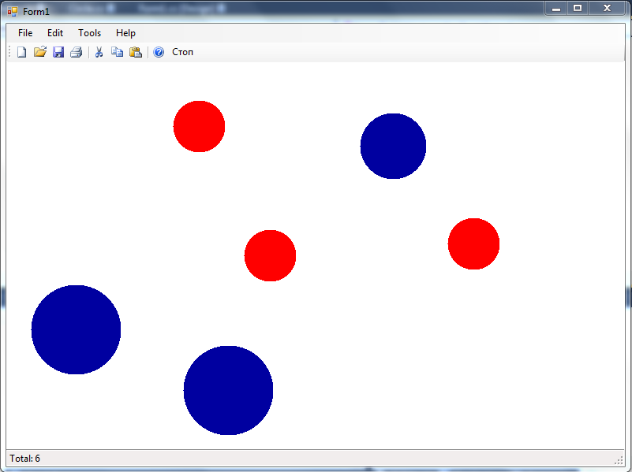

Да се имплементира апликација во која ќе се исцртуваат топчиња кои пулсираат.

Топчињата (радиус 30 пиксели) се додаваат со двоен лев клик во рамките на прозорецот. **15 поени** 

Со клик на копчето **Старт** од алатникот, на секои 100 милисекунди на секое од топчињата му се зголемува радиусот за 10% од почетниот радиус. Кога ќе се зголеми за 100%, големината му се ресетира на почетната. (Со ова се постигнува пулсирањето)  **20 поени**

Актуелната боја на топчињата кои се креираат се менува од главното мени Edit->Color. **5 поени**

На статусната линија се прикажува моменталниот број на тековни топчиња. **5 поени**

Да се имплементира серијализација (зачувување и вчитување) во датотека на состојбата на оваа апликација. **5 поени**

**За сите останати функционалности тестирајте ја извршната верзија на апликацијата која може да ја симнете подолу.**

