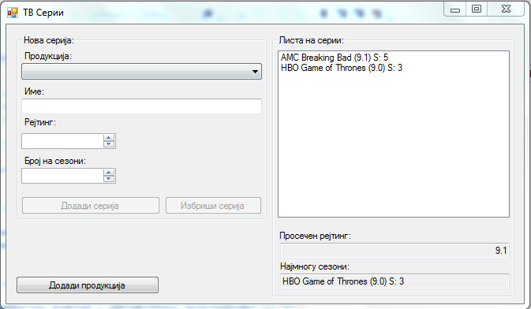
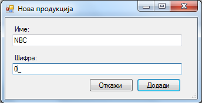

Да се имплементира `Windows Forms` апликација во која се чува листа на ТВ серии. За секоја серија се чува:

- продукција (продукциска куќа на серијата опишана со име и код (2 цифри))
- име (string)
- рејтинг (децимален број, мин 0, макс. 10, чекор 0.1)
- број на сезони (цел број).

Треба да се имплементираат следните функционалности:

- додавање нова продукција (клик на копчето **Додади нова продукција**) во листата со продукции `ComboBox`
 - се отвара нова форма во која се внесуваат валидни информации (името не смее да биде празно, шифрата треба да биде составена од точно 2 цифри) за продукцијата (се имплментира со `ErrorProvider`)
 - да се имплементира валидација дали постои продукција со таква шифра, ако постои да се прикаже со `Error Provider`
- додавање серија во листата со ТВ серии (клик на копчето **Додади серија**)
 - се додека не се избере продукција и не се внесе име копчето за додавање да биде оневозможено
- пресметување на просечен рејтинг на сериите во листата
- наоѓање на серијата со најмногу сезони (ако има повеќе со ист број, првата се прикажува)

**За сите останати функционалности тестирајте ја извршната верзија на апликацијата која може да ја симнете подолу.**

