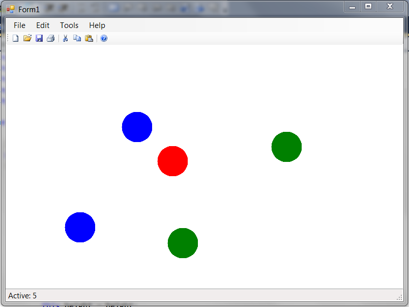

Да се имплементира апликација во која ќе се исцртуваат три видови на топчиња (црвени, зелени и сини). Радиусот на топчињата е 30. **(20 поени)**

Со двоен лев клик на глувчето на кликнатата позиција се исцртува по случаен избор зелено или сино топче. Црвено топче се исртува ако се кликне со десен единечен клик. **(10 поени)**

Со лев клик врз одредено црвено топче, тоа почнува да се движи во случајна насока (нагоре, надолу, лево или десно) со брзина на придвижување од 10 точки на секои 50 милисекунди. **(20 поени)**

По излегување од работниот прозорец црвеното топче се брише (се намалува бројот на топчиња прикажани на статусната линија).

При движењето, ако црвенто топче допре зелено топче го уништува (брише), а минува преку сините и другите црвени топчиња.**(20 поени)**

Во секој момент само едно црвено топче може да се движи. Кликнување над црвено топче додека друго се движи по екранот, се игнорира. **(10 поени)**

На статусната линија се прикажува моменталниот број на топчиња во работниот прозорец. **(10 поени)**

Да се имплементира серијализација (зачувување и вчитување) во датотека на состојбата на оваа апликација. **(10 поени)**

Достапна ви е извршна верзија на апликацијата преку која може детално да ги тестирате сите функционалности кои треба да се имплементираат.
