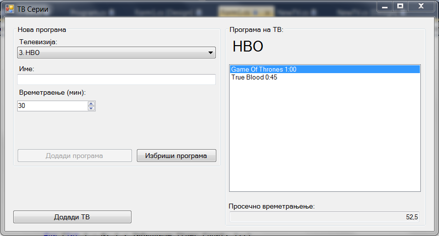

Да се имплементира `Windows Forms` апликација во која се чува листа на Телевизии (ТВ). За секоја телевизија се чува:

- листа на програма која се емитува (опишани со име на програмата и времетраење во минути)
- име (string)
- број (цел број).

Треба да се имплементираат следните функционалности:

- додавање нова телевизија (клик на копчето **Додади ТВ**) во листата со ТВ `ComboBox` **(10 поени)**
 - се отвара нова форма во која се внесуваат валидни информации (името не смее да биде празно)
 - да се имплементира валидација дали веќе постои телевизија со таков број и ако постои да се прикаже грешка со `Error Provider` **(10 поени)**
- додавање програма во листата за програма за избраната телевизија (клик на копчето **Додади програма**) **(10 поени)**
- при промена на избраната телевизија во листата за програма се прикажува само програмата на оваа телевизија **(5 поени)**
 - се додека не се избере телевизија и не се внесе име копчето за додавање да биде оневозможено **(5 поени)**
- пресметување на просечено времетраење на програмите **(5 поени)**
- бришење на програма од телевизијата со клик на **Избриши програма** кое е активно само ако има избрано програма (со прозорец за потврда на акцијата) **(5 поени)**

**За сите останати функционалности тестирајте ја извршната верзија на апликацијата која може да ја симнете подолу.**

Изглед на апликацијата:

