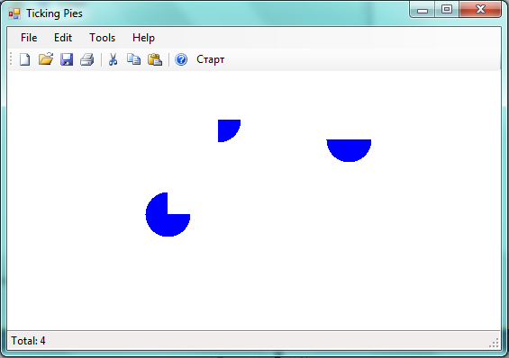

Да се имплементира апликација која ќе исцртува кругови со лев клик на глувчето. Со помош на тајмер со интервал на 1 секунда, круговите се трансформираат во пити, така што на секоја секунда се одзема по една четвртина од кругот, почнувајќи од позитивниот дел на X-оската во насока обратна од насоката на стрелката на часовникот. Тајмерот се стартува/стопира со клик на копчето „Старт/Стоп“ од алатникот на апликацијата.

Бојата на следниот круг кој ќе се додаде може да се менува од дијалог за избор на боја кој се активара од соодветното мени во Edit->Color. Почетната боја е сина.

Радиусот на круготвите е 25 пиксели.

На статусната линија се прикажува моменталниот број на кругови/пити кои се исцртани.

Да се имплементира серијализација (зачувување и вчитување) во датотека на состојбата на оваа апликација.

 
Достапна ви е извршна верзија на апликацијата преку која може детално да ги тестирате сите функционалности кои треба да се имплементираат.
